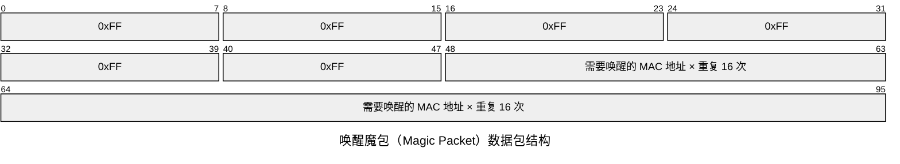

<abbr title="Wake-on-LAN，局域网唤醒">WoL</abbr> 是一种网络标准，它允许通过网络消息打开计算机或从睡眠模式中唤醒计算机，即所谓的「<ruby>网络<rp>(</rp><rt>局域网</rt><rp>)</rp></ruby>唤醒」。\
不仅仅只有 <abbr title="Personal Computer，个人计算机，俗称电脑&#10;（有这个定语是因为计算机曾经是一种极贵重的「高端」设备，很少有私人负担得起）">PC</abbr>，<abbr title="Network Attached Storage，网络附加存储&#10;一般位于本地的存储专用服务器（其实绝大多数情况下就相当于 PC），可以理解为自建网盘">NAS</abbr>、打印机……等很多数码设备都**可能**会支持这个功能。

## 前提条件

- 设备本身支持：用之前肯定要有。~~总不能无中生有虚空启用某个不存在的功能吧。~~\
  对于电脑来说主要是看主板是否支持 <abbr title="PCI-Express，Peripheral Component Interconnect Express">PCIe</abbr> 2.2 标准。（这个功能出现得非常早[^wol]，~~还能开机~~ 现存于市的绝大多数电脑主板都是支持的。）
- 电源保持通电：同样容易理解，电都没有~~拿头开机~~[^power]。另外，如果曾经意外断电过，网络唤醒可能会失败，需要手动开机再关机后才能正常使用（~~<abbr title="Uninterruptible Power Supply，不间断电源">UPS</abbr> 还是有用~~）。
- 有网络连接：被唤醒的设备一般需要与路由器**有线**连接。无线也行，但需要支持 <abbr title="Wake on Wireless LAN，无线局域网唤醒">WoWLAN</abbr> 的补充标准（可以~~加钱解决一切问题~~ 换网卡）。

[^wol]: WoL 技术由 AMD 和惠普共同开发，于 1995 年作为标准提出。此后，该标准很快被 IBM、Intel 和其他公司采用。
[^power]: 我知道 <abbr title="Power over Ethernet，以太网供电">PoE</abbr> 可以用标准网线（RJ45 接口，[以后可能会变](https://info.support.huawei.com/info-finder/encyclopedia/zh/%E5%85%89%E7%94%B5%E6%B7%B7%E5%90%88%E7%BC%86.html)）供电，但都是用在交换机、视频监控摄像头、无线 <abbr title="Access Point，接入点">AP</abbr> 等小型设备上，谁家 PoE 带得动电脑啊。

## 配置步骤

### 启用主板支持

1. 开机时在准确时机按下 <kbd>Del</kbd>（有些是 <kbd>F2</kbd>）进入 <abbr title="Basic Input Output System">BIOS</abbr> 界面，找到以下类似设置：
	- `wake on WAN`
	- `remote wake-up`
	- `power on by LAN`
	- `power up by LAN`
	- `resume by LAN`
	- `resume on LAN`
	- `wake up on LAN`
	- 总之关键词就是 `wake`、`WOL`，如果看到 `PCIe`、`ACPI` 的菜单也可以进去找找
	- 如果 BIOS 支持中文界面就不用多说了，`唤醒` / `开机`，~~你至少识字吧~~
	- 设置为 `enable` / `启用`
2. 如果没有的话，考虑升级 BIOS：
	- 用任意搜索引擎搜自己的主板品牌 + 型号（BIOS 里会写），进入主板的**官网**
	- 参考官方说明将 BIOS 升级到最新版本

### 确保网卡支持

在主板官网找到对应的网卡驱动（其实声卡也推荐更新一下驱动）。

我知道从 Windows 10 开始，装好系统并联网后会自动搜索并安装驱动，非常省心。\
但这样自动装好的驱动仅仅只是「能用」而已（有时甚至没法用），智能，但不够智能。

只有装好合适（同时适配软件 / 硬件两方面）的驱动才能获得最佳性能。\
那么问题来了，如何得知对于自己的<ruby>网卡<rp>(</rp><rt>硬件</rt><rp>)</rp></ruby>（型号）来说，相对最好的<ruby>驱动<rp>(</rp><rt>软件</rt><rp>)</rp></ruby>版本呢？\
别想了，直接去主板官网下人家官方提供的，你猜商业化公司调试后发布出来的和你一拍脑门随手网上搜的哪个更好。

1. 组合键 <kbd>Win</kbd> + <kbd>X</kbd> 打开快捷菜单，按 <kbd>M</kbd> 进入 _设备管理器_
2. 在 _网络适配器_ 一栏下找到网卡（名称形如 `Realtek PCle GbE Family Controller`）
3. 双击或右键打开 _属性_，如果安装好了合适的驱动，这里会有多达 7 个选项卡
4. 切换到 _高级_ 选项卡，将属性 `魔术封包唤醒` / `网络唤醒` 的值设置为 `开启`
5. 切换到 _电源管理_ 选项卡，勾选 `允许此设备唤醒计算机`\
   （这里的 _此设备_ 指的是网卡）
6. 至于下面的 `只允许幻数据包唤醒计算机`，是否启用看具体情况\
   （如果在你自己家里可以不勾；如果在公司之类的公共场合，本来没想打开的设备经常被他人莫名其妙打开，可以勾上防止骚扰）

### 系统设置

#### 电源状态

对于人（在感知上）来说，机器好像不是开就是关。

但对于硬件和系统来说，除了「开」和「关」还有其他很多种状态。\
电源接口 ACPI 规范定义了 [系统电源状态](https://learn.microsoft.com/zh-cn/windows/win32/power/system-power-states)：

| 电源状态                                                                                                            | ACPI 状态              | 说明                                                                                                                                                                                                                                                                                   |
| --------------------------------------------------------------------------------------------------------------- | -------------------- | ------------------------------------------------------------------------------------------------------------------------------------------------------------------------------------------------------------------------------------------------------------------------------------ |
| <ruby>正在运行<rp>(</rp><rt>Working</rt><rp>)</rp></ruby>                                                           | _S0_                 | 系统完全可用。<br>未使用的硬件组件可以通过进入较低的电源状态来节省电量。                                                                                                                                                                                                                                               |
| <ruby>睡眠<rp>(</rp><rt>Sleep</rt><rp>)</rp></ruby>（<ruby>新式待机<rp>(</rp><rt>Modern Standby</rt><rp>)</rp></ruby>） | _S0_ 低功耗空闲           | 某些 SoC 系统支持称为 [新式待机](https://learn.microsoft.com/zh-cn/windows-hardware/design/device-experiences/modern-standby) 的低功耗空闲状态。<br>在此状态下，系统可以非常快速地从低功耗状态切换到大功率状态，以响应硬件和网络事件。支持新式待机的系统不使用 _S1-S3_。                                                                                        |
| <ruby>睡眠<rp>(</rp><rt>Sleep</rt><rp>)</rp></ruby>                                                               | _S1_<br>_S2_<br>_S3_ | 系统似乎已关闭。耗电量 _S0_ > **_S1_ > _S2_ > _S3_** > _S4_。<br>系统通常支持这三种状态之一，而不是全部三种状态。<br><br>在状态 _S1-S3_ 中，将保持刷新易失性内存以维护系统状态。<br>某些组件保持供电状态，因此计算机可以从键盘、LAN 或 USB 设备的输入唤醒。<br><br>_混合睡眠_（在桌面上使用）是系统使用 _S1-S3_ 休眠文件的位置。<br>休眠文件会保存系统状态，以防系统在睡眠状态下断电。<br><br>**注意：** 支持新式待机的 SoC 系统不使用 _S1-S3_。 |
| <ruby>休眠<rp>(</rp><rt>Hibernate</rt><rp>)</rp></ruby>                                                           | _S4_                 | 系统似乎已关闭。将功耗降低到最低水平。<br>系统将易失性内存的内容保存到休眠文件中，以保留系统状态。某些组件保持供电状态，因此计算机可以从键盘、LAN 或 USB 设备的输入唤醒。如果工作上下文存储在非易失媒体上，则可以还原它。<br><br>_快速启动_ 是在创建休眠文件之前注销用户的位置。<br>这允许使用较小的休眠文件，更适合存储功能较少的系统。                                                                                                   |
| <ruby>软关闭<rp>(</rp><rt>Soft off</rt><rp>)</rp></ruby>                                                           | _S5_                 | 系统似乎已关闭。此状态由完全关闭和启动周期组成。                                                                                                                                                                                                                                                             |
| <ruby>机械关闭<rp>(</rp><rt>Mechanical off</rt><rp>)</rp></ruby>                                                    | _G3_                 | 系统完全关闭，不消耗任何电源。<br>仅在完全重启后，系统才会返回到工作状态。                                                                                                                                                                                                                                              |

如果设置了网络唤醒，你的电脑在睡眠（S3）、休眠（S4）或关机（S5）时，网卡仍然处于待机状态（此时网卡的电源由 PCIe 总线提供），以接收网络消息唤醒主板（开机）。

从 Windows 8.1 开始至今（Windows 11），系统将「<ruby>快速启动<rp>(</rp><rt>Fast Startup</rt><rp>)</rp></ruby>（S4）」作为默认的「关机」方式。而在这种关机状态下，是**不支持网络唤醒**的。\
这也是全网绝大多数 WoL 相关的教程（包括本文）都会教你 [关闭 _快速启动_](https://learn.microsoft.com/zh-cn/troubleshoot/windows-client/setup-upgrade-and-drivers/wake-on-lan-feature#more-information) 的原因：

1. <kbd>Win</kbd> + <kbd>S</kbd> 打开快速搜索，输入 `控制面板`
2. `硬件和声音` > `电源选项` > `更改电源按钮的功能`
3. 在下面的 `关机设置` 里 **取消勾选** `启用快速启动(推荐)`\
   （如果是灰的无法设置，先点击 `更改当前不可用的设置` 进行授权）

#### 睡眠、休眠和快速启动

如果你打开上面提到的链接，会看到微软官方明确指出：\
从 Windows 10 开始，系统的**默认**关闭行为将设置成 <ruby>混合关闭<rp>(</rp><rt>快速启动</rt><rp>)</rp></ruby> 状态（S4），此时不支持来自 S4 或 S5 的 WoL 网络唤醒。\
（虽然 _快速启动_ 和 _休眠_ 的状态一样都是 S4，但它明确禁用了 WoL。）

只有关闭 _快速启动_ 后，WoL 才会生效。此时——
- 无论（长时间无输入）被动 _睡眠_（S3）
	- 把当前系统工作状态保存到内存，进入低功耗状态
	- 唤醒非常快
	- 此时断电会丢失未保存的数据
- 还是（用户显式请求）主动 _休眠_（S4）
	- 把当前系统工作状态保存到硬盘，然后完全关机
	- 唤醒比 _睡眠_ 慢，但仍然比（普通的）_关机_ 快
	- 由于数据都在硬盘上，因此哪怕断电，未保存的数据也不会丢失（这里的 _未保存_ 指的是程序上未保存，但此时整个系统状态都被保存到硬盘了，并不矛盾）

都支持 WoL。

总结一下，_休眠_ 和 _快速启动_ 压根不是一码事。\
有些~~半罐水响叮当的~~ 低劣教程让你去关 _休眠_ 纯属误人子弟。

#### 验证设置成功

可以 <kbd>Win</kbd> + <kbd>R</kbd> 运行 `cmd /k powercfg /a` 查看：
```
此系统上有以下睡眠状态:
    待机 (S3)
    休眠
    混合睡眠

此系统上没有以下睡眠状态:
    待机 (S1)
        系统固件不支持此待机状态。

    待机 (S2)
        系统固件不支持此待机状态。

    待机(S0 低电量待机)
        系统固件不支持此待机状态。

    快速启动
        当前系统策略禁用此动作。
```

### 最终成果

如果没有其他问题，将配置好的本机正常关机；再通过路由器后台的「网络唤醒」功能，或者手机上的相关 App（比如 [Fing](https://www.fing.com/fing-app/)）就可以尝试远程启动这台电脑了。

> 当然最好是在路由器上给这类需要开放服务给其他设备使用的机器绑定 **静态 IP**，一般在 DHCP 配置里。

## 其他问题

### 断电恢复

开头提到过「如果曾经意外断电过，网络唤醒**可能**会失败」。

这是因为 WoL 的原理是「关电脑不关网卡」：虽然关机了，但网卡仍然处于<ruby>待机<rp>(</rp><rt>Standby</rt><rp>)</rp></ruby>状态。
如果意外断电（比如停电、拔电源），相当于中断了整个系统的电源，所有硬件——无论你有多底层——都得离线关闭。

系统离线后再恢复供电，在重新上电后，有些可以自动恢复到断电之前的状态；\
有些就不行了，因此网络唤醒就失效了。

可以自动恢复的情况：
- 看看 BIOS 里是否支持 `Restore AC Power Loss`，设置为 `Last State`（之前的状态）
  （中文叫 `断电恢复` / `来电开机`）
- 并禁用 `Deep Power Off Mode`\
  （中文叫 `深度睡眠` / `深度节能模式` / `超低电量模式`）

### ARP 绑定

所谓 <abbr title="Address Resolution Protocol，地址解析协议">ARP</abbr> 就是将路由器分配的 IP 和设备的硬件地址 <abbr title="Media Access Control (Address)，媒体访问控制地址&#10;也称为物理地址（Physical Address）">MAC</abbr> 进行绑定。

当家里真的停电时，显然路由器也会关机。\
有些路由器可以断电恢复，这没有问题；而有些路由器在长时间关机（或者 <abbr title="Time To Live，生存时间">TTL</abbr> 到期）后，会将 ARP 表中的设备 MAC 地址移除（ARP 缓存失效），导致静态 IP 设置失效，此时从外网连到家里进行 WoL 就会失败。

解决方案：设置路由器开机自动运行的脚本，实现路由器开机自动绑定 ARP。\
（具体有需要请自行搜索教程，本文由于篇幅原因不再过多展开赘述。）

配置好这个可以实现家里的 NAS 等需要 24 小时运行的机器哪怕在停电后，来电也能自动开机（ARP 绑定 + WoL）。

> 你有 UPS 也没用，UPS 又不是发电机，该停电就是会停电。\
> UPS 的意义在于设置一个安全缓冲，当外部供电消失时不直接给所有设备断电（可能造成数据丢失乃至设备损坏），而是通知设备「该主动下线了」，实现断电安全停机。

### 端口转发

> 没想到 _计算机网络_ 老师教给我的东西~~居然有用~~。

| 层级  | OSI 七层模型 | TCP/IP 五层模型 | 常用协议                           |
| --- | -------- | ----------- | ------------------------------ |
| 7   | 应用层      | 应用层         | HTTPS、HTTP、Telnet、FTP、SMTP、DNS |
| 6   | 表示层      |             |                                |
| 5   | 会话层      |             |                                |
| 4   | 传输层      | 传输层         | TCP、UDP                        |
| 3   | 网络层      | 网络层         | IP、ICMP、RIP、IGMP、OSPF          |
| 2   | 数据链路层    | 数据链路层       | 以太网、令牌环、PPP、PPTP、L2TP、ARP、ATMP |
| 1   | 物理层      | 物理层         | 物理线路（网线）、光纤、无线电                |

WoL 是「以太网或令牌环计算机网络标准」，显然在第二层 _数据链路层_ 传播。\
从上表可以看到，无关具体的传输协议（TCP / UDP），只要网卡识别到特定的 _广播帧_ 就可以实现相应功能（唤醒电脑）。

但是，路由器工作在第三层 _网络层_，想要从外面通过外网连回家里唤醒电脑，就需要让路由器转发端口，向外面暴露相应的端口来接收「<ruby>唤醒魔包<rp>(</rp><rt>Magic Packet</rt><rp>)</rp></ruby>」。



> ~~其实这玩意想想就很魔性，咳嗽一声，然后狂喊你名字 16 次，试图「唤醒」你。~~\
> 它也不需要你应答，就是单方面通知你「该醒了」，因此显然应该走 UDP 协议。

如果是内网穿透（端口转发）的使用场景，如下表所示：

| 协议      | 内网 IP           | 内网端口        | 外网 IP          | 转发出来的外网端口 |
| ------- | --------------- | ----------- | -------------- | --------- |
| ~~UDP~~ | `192.168.1.123` | ~~`9`~~     | `57.182.*.111` | `19999`   |
| 确定      | 视具体情况变化         | 有时可以考虑用 `7` | 视具体情况变化        | 视具体情况变化   |

只要能够通过**外网 IP + 端口**访问到指定机器的**内网 IP**，内网端口和协议都不重要了。\
因为前面提到过，WoL 的 _唤醒魔包_ 工作在 _数据链路层_，与协议 / 端口无关，只要找到内网 IP，路由器（在 ARP 绑定的作用下）就能（通过 MAC 寻址）找到对应的设备。

> 对于电脑来说，实际上路由器找到的是电脑的**网卡**，而不是「电脑」这个笼统的整体概念，光靠主板或者其他什么配件并不能凭空联网（Wi-Fi 也得走无线网卡）。

设备一旦接收到这个数据包，只要它认出来是唤醒魔包 && 恰好这个唤醒魔包喊的就是它的名字（MAC 地址），它就会知道「该开机了」。

> 参考阅读：《[Does it matter what UDP port a WOL signal is sent to?](https://superuser.com/questions/295325/does-it-matter-what-udp-port-a-wol-signal-is-sent-to)》

### 最佳实践

唤醒魔包的本质是一种广播帧，**无法被路由器转发**：
- 发送到 `255.255.255.255` 同一局域网下（本地广播）
- 发送到 `192.168.1.255` 特定子网下的广播地址
- 发送到 `192.168.1.0/24` 从 `192.168.1.1` 到 `192.168.1.254` 的特定网段

因此如果使用内网穿透，从外网直接发送 WoL 请求，就必须依靠路由器的 ARP 绑定来**精确**地把数据包投喂到设备嘴里。

但如果是同在内网下的设备，可以在子网内**广播**（通知当前所有在线的设备）数据包。\
当对应的网卡发现「欸，叫的是我」（唤醒魔包重复了 16 次 MAC 地址还记得吗），就会启动电脑。这种情况下是不需要再去寻找特定 IP 的。

那么外网可以通过任意方式（比如 SSH）连接到内网设备（比如路由器、NAS 或正经的服务器）的终端，让内网的机器执行命令（比如 `wakeonlan`），可以轻松搞定 WoL。

```Bash
# 安装软件包 当然还有其他同类工具可选 比如 wol etherwake 等等
$ apt-get install wakeonlan

# 发送网络唤醒广播 需要指定设备的 MAC
$ wakeonlan AA:BB:CC:DD:EE:FF

# 好处在于只要修改一行参数可以轻松唤醒另一台设备
$ wakeonlan 11:22:33:44:55:66
# 如果是走直连端口转发的方案 那么有几台设备就要去配置几条隧道绑定 IP
```

只要把思路扩展到终端执行命令，可玩性就多了，甚至可以做成网页服务。\
一旦做到网页服务，适用范围就更广了，比如聊天机器人（发一条微信 = 远程开机）。

我个人使用的方案是高度结合 [ntfy](https://ntfy.sh/)：当某个设备关机时（通过某种 uptime 服务监控）会立刻推送通知到我的手机上（通过 [ntfy 的移动端应用](https://github.com/binwiederhier/ntfy-android)）。\
我也可以通过手机 [发送通知](https://docs.ntfy.sh/subscribe/cli/#run-command-for-every-message)，让服务器（通过命令 + WoL）再次启动关机的设备。

爽到。
